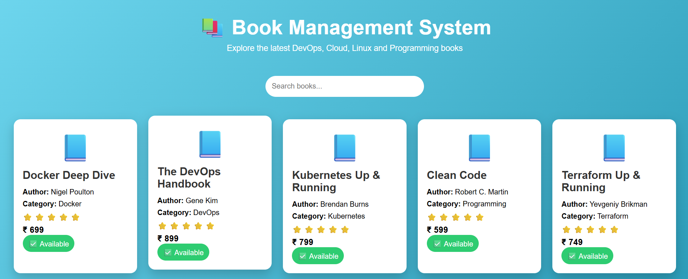
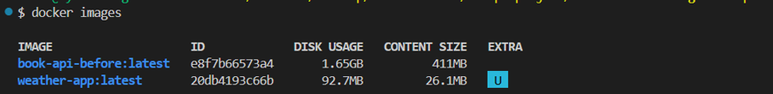
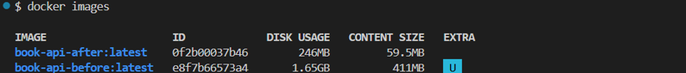
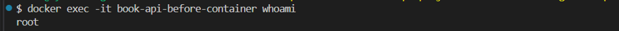
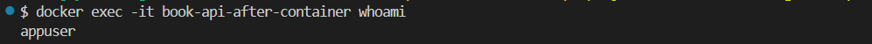
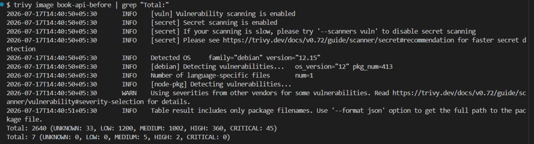
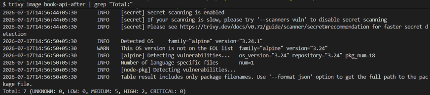
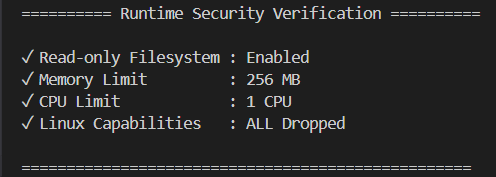

# 📚 Book Management API - Docker Security & Optimization

<p align="center">


</p>

<p align="center">
A production-ready <b>Book Management API</b> demonstrating <b>Docker Image Optimization</b>, <b>Container Security Hardening</b>, and <b>Runtime Security Best Practices</b>.
</p>

---

# 📖 Project Overview

This project demonstrates how to convert a standard Dockerized Node.js application into a lightweight, secure, and production-ready container.

The application is a simple **Book Management Web Application** built using **Node.js**, **Express.js**, and **EJS**. The focus of this project is not only the application itself but also implementing Docker best practices such as:

- Multi-stage Docker builds
- Lightweight Alpine Linux images
- Running containers as a non-root user
- Reducing image size
- Vulnerability scanning using Trivy
- Runtime security using Docker security flags

---

# 📸 Application Preview

> Replace the image below with your application screenshot.



---

# 🚀 Technologies Used

| Category | Technologies |
|----------|--------------|
| Backend | Node.js, Express.js |
| Frontend | EJS, HTML, CSS |
| Containerization | Docker |
| Security | Trivy |
| Operating System | Alpine Linux |
| Version Control | Git & GitHub |

---

# 📁 Project Structure

```text
book-management-api/
│
├── screenshots/
│   ├── application-homepage.png
│   ├── Part1-Image-Optimization/
│   ├── Part2-Security-Hardening/
│   └── Part3-Runtime-Security/
│
├── src/
│   ├── data/
│   ├── public/
│   ├── routes/
│   └── views/
│
├── Dockerfile
├── Dockerfile.optimized
├── .dockerignore
├── .gitignore
├── package.json
├── package-lock.json
├── server.js
└── README.md
```

---

# 🏗️ Architecture

```text
                 User
                  │
                  ▼
      Browser (localhost:3000)
                  │
                  ▼
      Docker Container
                  │
                  ▼
        Node.js + Express
                  │
                  ▼
             EJS Views
                  │
                  ▼
            books.json
```

---

# ✨ Features

- 📚 Book Management Web Application
- 🔍 Search Books
- 🎨 Responsive User Interface
- 🐳 Dockerized Deployment
- ⚡ Multi-stage Docker Build
- 📦 Lightweight Alpine Image
- 🔒 Non-root Container
- 🛡️ Runtime Security
- 🔍 Trivy Vulnerability Scanning

---

# 📊 Before vs After Comparison

| Feature | Before | After |
|----------|--------|-------|
| Base Image | node:22 | node:22-alpine |
| Build Type | Single Stage | Multi-stage |
| Image Size | **1.65 GB** | **246 MB** |
| Root User | Yes | No |
| `.dockerignore` | No | Yes |
| Critical Vulnerabilities | **45** | **0** |
| High Vulnerabilities | **360** | **2** |
| Read-only Filesystem | ❌ | ✅ |
| CPU Limit | ❌ | ✅ |
| Memory Limit | ❌ | ✅ |
| Linux Capabilities | Default | Dropped |

---

# 🐳 Part 1 – Docker Image Optimization

## Objective

Reduce Docker image size while following Docker image optimization best practices.

## Improvements

- Switched from **node:22** to **node:22-alpine**
- Implemented **Multi-stage Docker Build**
- Installed only production dependencies
- Added `.dockerignore`
- Optimized Docker image layers
- Reduced image size by approximately **85%**

## Image Size Comparison

| Before | After |
|---------|-------|
| **1.65 GB** | **246 MB** |

### Before Build



### After Build



### Image Size Comparison


---

# 🔒 Part 2 – Security Hardening

## Objective

Improve container security by following Docker and Linux security best practices.

## Security Improvements

The optimized Docker image was hardened using the following techniques:

- ✅ Alpine Linux base image
- ✅ Multi-stage Docker build
- ✅ Non-root user (`appuser`)
- ✅ Production dependencies only (`npm ci --omit=dev`)
- ✅ Removed unnecessary build artifacts
- ✅ Vulnerability scanning using Trivy

---

## 👤 Container User

### Before

The application runs as the **root user**, which is not recommended because a compromised application could gain elevated privileges inside the container.

```dockerfile
FROM node:22
```

### After

A dedicated non-root user is created and used to run the application.

```dockerfile
RUN addgroup -S appgroup && adduser -S appuser -G appgroup
USER appuser
```

Running containers as a non-root user significantly improves container security and aligns with Docker best practices.

### Before (Root User)



### After (Non-root User)



---

# 🔍 Vulnerability Scanning

The Docker images were scanned using **Trivy**.

### Before Optimization

| Severity | Count |
|----------|------:|
| Critical | **45** |
| High | **360** |
| Medium | **1002** |

### After Optimization

| Severity | Count |
|----------|------:|
| Critical | **0** |
| High | **2** |
| Medium | **5** |

### Result

- Eliminated all critical vulnerabilities.
- Reduced high vulnerabilities from **360** to **2**.
- Reduced medium vulnerabilities from **1002** to **5**.

> **Note:** The remaining vulnerabilities are related to application dependencies rather than the underlying operating system.

### Trivy Scan (Before)



### Trivy Scan (After)



---

# 🛡️ Part 3 – Runtime Security

## Objective

Protect the running container by applying Docker runtime security controls.

The optimized container was started using the following command:

```bash
docker run -d \
--name secure-book-api \
-p 3002:3000 \
--memory=256m \
--cpus=1 \
--read-only \
--cap-drop=ALL \
book-api-after
```

---

## Runtime Security Features

### 🔒 Read-only Filesystem

Prevents applications from modifying the container filesystem.

### 💾 Memory Limit

Restricts memory usage to **256 MB**.

### ⚙️ CPU Limit

Limits CPU usage to **1 CPU**.

### 🛡️ Drop Linux Capabilities

Removes unnecessary Linux capabilities to reduce the attack surface.

---

## Runtime Verification

```text
========== Runtime Security Verification ==========

✓ Read-only Filesystem : Enabled
✓ Memory Limit         : 256 MB
✓ CPU Limit            : 1 CPU
✓ Linux Capabilities   : ALL Dropped

==================================================
```

### Runtime Security Screenshot



---

# 🐳 Dockerfile Comparison

## Before

```dockerfile
FROM node:22

WORKDIR /app

COPY . .

RUN npm install

EXPOSE 3000

CMD ["npm","start"]
```

### Limitations

- Uses a large base image.
- Installs development dependencies.
- Runs as the root user.
- Larger attack surface.
- Larger image size.

---

## After

### Improvements

- Multi-stage Docker build
- Alpine Linux
- Production-only dependencies
- Non-root user
- Optimized Docker layers
- Smaller image size
- Improved security
- Faster deployment

---


# ▶️ Running the Application

## Clone the Repository

```bash
git clone https://github.com/<your-username>/book-management-api.git
cd book-management-api
```

---

## Install Dependencies

```bash
npm install
```

---

## Run the Application

```bash
npm start
```

The application will be available at:

```text
http://localhost:3000
```

---

# 🐳 Docker Commands

## Build the Basic Image

```bash
docker build -t book-api-before .
```

---

## Build the Optimized Image

```bash
docker build -f Dockerfile.optimized -t book-api-after .
```

---

## Run the Optimized Container

```bash
docker run -d \
--name secure-book-api \
-p 3002:3000 \
--memory=256m \
--cpus=1 \
--read-only \
--cap-drop=ALL \
book-api-after
```

---

## View Running Containers

```bash
docker ps
```

---

## Verify Runtime Security

```bash
docker inspect -f "ReadOnly={{.HostConfig.ReadonlyRootfs}} Memory={{.HostConfig.Memory}} NanoCPUs={{.HostConfig.NanoCpus}} CapDrop={{.HostConfig.CapDrop}}" secure-book-api
```

---

## Stop the Container

```bash
docker stop secure-book-api
```

---

## Remove the Container

```bash
docker rm secure-book-api
```

---

# 📊 Results Summary

| Metric | Before | After |
|----------|---------:|---------:|
| Base Image | node:22 | node:22-alpine |
| Image Size | 1.65 GB | **246 MB** |
| Image Size Reduction | — | **≈85%** |
| Critical Vulnerabilities | 45 | **0** |
| High Vulnerabilities | 360 | **2** |
| Medium Vulnerabilities | 1002 | **5** |
| Container User | root | appuser |
| Read-only Filesystem | ❌ | ✅ |
| CPU Limit | ❌ | ✅ |
| Memory Limit | ❌ | ✅ |
| Linux Capabilities | Default | Dropped |

---

# 🎯 Learning Outcomes

Through this project, I gained hands-on experience with:

- ✅ Docker image optimization
- ✅ Multi-stage Docker builds
- ✅ Docker layer caching
- ✅ Alpine Linux
- ✅ Docker security best practices
- ✅ Running containers as a non-root user
- ✅ Trivy vulnerability scanning
- ✅ Runtime security controls
- ✅ Read-only containers
- ✅ CPU and memory resource limits
- ✅ Dropping unnecessary Linux capabilities
- ✅ Building production-ready Docker images

---

# 🚀 Future Improvements

Possible enhancements for this project include:

- Store book data in MySQL or PostgreSQL
- Build REST APIs for CRUD operations
- Add JWT-based authentication
- Deploy to Kubernetes
- Integrate GitHub Actions CI/CD
- Push images to Docker Hub
- Add Prometheus and Grafana monitoring
- Deploy to AWS or Google Cloud Platform

---

# 📚 References

- Docker Documentation: https://docs.docker.com/
- Trivy Documentation: https://trivy.dev/latest/
- Node.js Documentation: https://nodejs.org/
- Express.js Documentation: https://expressjs.com/

---

# 👨‍💻 Author

**Arun**

**DevOps Engineer**

### Skills

- Docker
- Kubernetes
- AWS
- Google Cloud Platform (GCP)
- Terraform
- GitHub Actions
- Linux
- Bash
- Networking

---

## ⭐ If you found this project useful, consider giving it a star!

This project demonstrates practical Docker optimization and security techniques that can be applied to production containerized applications.